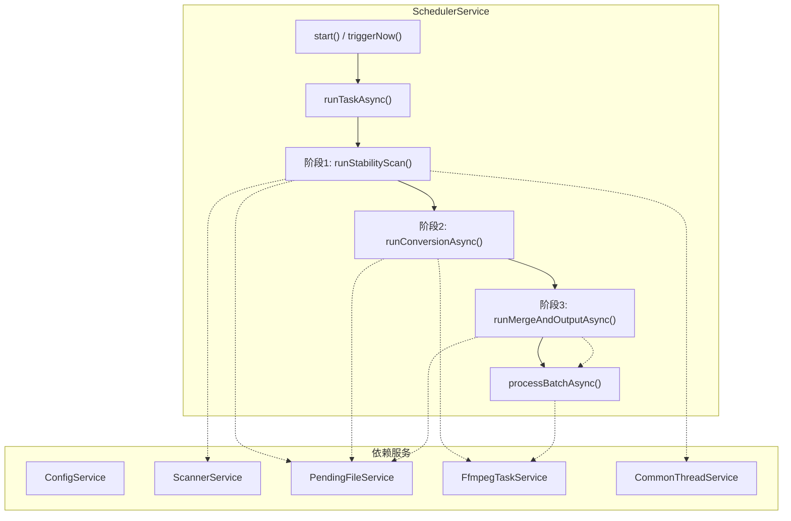
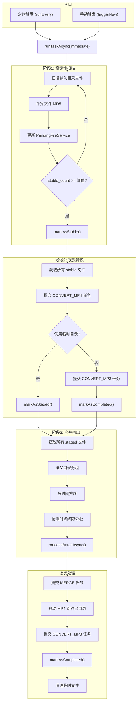
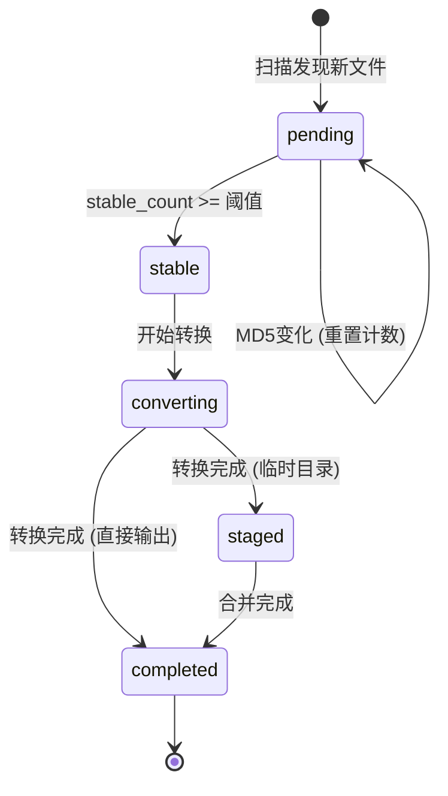

# SchedulerService 任务执行逻辑与交互结构

## 整体架构



---

## 任务执行流程详解



---

## 文件状态流转



---

## 服务交互关系

| 阶段 | 服务调用 | 执行方式 | 说明 |
|------|----------|----------|------|
| **阶段1** | `ScannerService::scan()` | 同步 | 扫描输入目录获取文件列表 |
| | `FileUtils::calculateMD5()` | 同步 (线程池) | CPU密集型，在线程池执行 |
| | `PendingFileService::addOrUpdateFile()` | 同步 | 更新文件状态和MD5 |
| | `PendingFileService::markAsStable()` | 同步 | 标记达到稳定阈值的文件 |
| **阶段2** | `PendingFileService::getAllStableFiles()` | 同步 | 获取待转换文件 |
| | `FfmpegTaskService::submitTask(CONVERT_MP4)` | **协程** | 提交MP4转换任务 |
| | `FfmpegTaskService::submitTask(CONVERT_MP3)` | **协程** | 提交MP3提取任务 |
| | `PendingFileService::markAsStaged/Completed()` | 同步 | 更新文件状态 |
| **阶段3** | `PendingFileService::getAllStagedFiles()` | 同步 | 获取已暂存文件 |
| | `MergerService::parseTime()` | 同步 | 解析文件名中的时间 |
| | `FfmpegTaskService::submitTask(MERGE)` | **协程** | 提交视频合并任务 |
| | `FfmpegTaskService::submitTask(CONVERT_MP3)` | **协程** | 从合并结果提取MP3 |

---

## 关键设计要点

### 1. 协程调度
`runTaskAsync()` 使用 `drogon::Task<void>` 实现非阻塞执行，三个阶段顺序执行但不阻塞事件循环。

### 2. 阻塞任务隔离
MD5计算等CPU密集操作通过 `CommonThreadService` 在独立线程池执行，避免阻塞协程调度器。

```cpp
co_await live2mp3::utils::awaitFuture(
    commonThreadServicePtr_->runTaskAsync([this]() { runStabilityScan(); }));
```

### 3. FFmpeg任务委托
所有FFmpeg操作通过 `FfmpegTaskService::submitTask()` 统一提交，支持三种任务类型：
- `CONVERT_MP4`: FLV转MP4 (AV1编码)
- `CONVERT_MP3`: 从MP4提取音频
- `MERGE`: 合并多个MP4文件

### 4. 并发控制
使用 `running_` 原子变量防止任务重叠执行：

```cpp
if (running_.exchange(true)) {
    LOG_INFO << "Task already running, skipping";
    co_return;
}
```

### 5. 批次合并逻辑
根据 `merge_window_seconds` 配置将时间相近的文件分组合并：
- 解析文件名中的时间戳
- 按时间排序
- 时间间隔超过阈值则分为新批次
- 立即模式(`immediate=true`)下不等待，直接处理所有文件

---

## 相关文件

- [SchedulerService.h](file:///home/code-dev/src/live2mp3/backend/services/SchedulerService.h)
- [SchedulerService.cc](file:///home/code-dev/src/live2mp3/backend/services/SchedulerService.cc)
- [FfmpegTaskService.h](file:///home/code-dev/src/live2mp3/backend/services/FfmpegTaskService.h)
- [PendingFileService.h](file:///home/code-dev/src/live2mp3/backend/services/PendingFileService.h)
- [CommonThreadService.h](file:///home/code-dev/src/live2mp3/backend/services/CommonThreadService.h)
