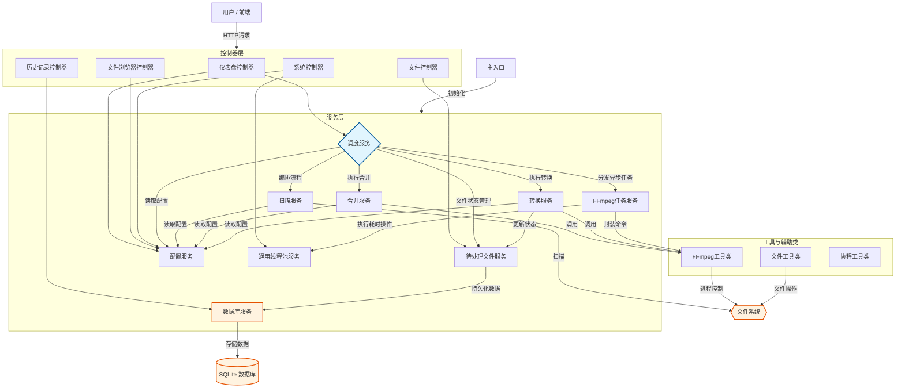

# 系统架构图

```mermaid
graph TD
    %% 入口点
    User[用户 / 前端]
    Main[主入口]

    %% 控制器层
    subgraph Controllers [控制器层]
        DC[仪表盘控制器]
        FBC[文件浏览器控制器]
        FC[文件控制器]
        HC[历史记录控制器]
        SC[系统控制器]
    end

    %% 服务层
    subgraph Services [服务层]
        Scheduler{调度服务}
        Scanner[扫描服务]
        Pending[待处理文件服务]
        Merger[合并服务]
        Converter[转换服务]
        FfmpegTask[FFmpeg任务服务]
        DB[数据库服务]
        Config[配置服务]
        Thread[通用线程池服务]
    end

    %% 工具层
    subgraph Utils [工具与辅助类]
        FfmpegUtils[FFmpeg工具类]
        FileUtils[文件工具类]
        CoroUtils[协程工具类]
    end

    %% 外部依赖
    SQLite[(SQLite 数据库)]
    FileSystem{{文件系统}}

    %% 关系连线
    User -->|HTTP请求| Controllers
    Main -->|初始化| Services
    
    %% 控制器 -> 服务依赖
    DC --> Scheduler
    DC --> Config
    FBC --> Config
    FC --> Pending
    HC --> DB
    SC --> Config
    SC --> Thread

    %% 调度服务 (核心协调者)
    Scheduler -->|编排流程| Scanner
    Scheduler -->|文件状态管理| Pending
    Scheduler -->|执行合并| Merger
    Scheduler -->|执行转换| Converter
    Scheduler -->|分发异步任务| FfmpegTask
    Scheduler -->|读取配置| Config

    %% 服务间依赖
    Scanner -->|读取配置| Config
    Scanner -->|扫描| FileSystem
    
    Pending -->|持久化数据| DB
    DB -->|存储数据| SQLite
    
    Merger -->|调用| FfmpegUtils
    Merger -->|读取配置| Config
    
    Converter -->|调用| FfmpegUtils
    Converter -->|读取配置| Config
    Converter -->|更新状态| Pending
    
    FfmpegTask -->|执行耗时操作| Thread
    FfmpegTask -->|封装命令| FfmpegUtils
    
    %% 工具类使用
    FfmpegUtils -->|进程控制| FileSystem
    FileUtils -->|文件操作| FileSystem

    %% 样式定义
    classDef primary fill:#e1f5fe,stroke:#01579b,stroke-width:2px;
    classDef secondary fill:#f3e5f5,stroke:#4a148c,stroke-width:2px;
    classDef storage fill:#fff3e0,stroke:#e65100,stroke-width:2px;
    
    class Scheduler primary;
    class DB,SQLite,FileSystem storage;
```
